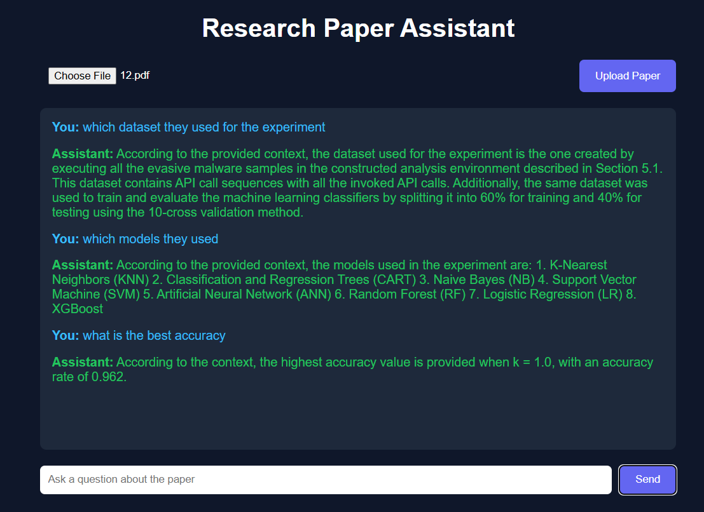

# Research Paper Assistant (RAG)

A RAG-based Research Paper Assistant that allows users to upload a research paper PDF and ask questions about it. The system retrieves relevant sections from the paper and generates context-aware answers using a local LLM. Everything runs locally and free.

## Features
- Upload research paper PDF
- Ask questions about the paper
- Multiple questions supported
- Context-aware answers using previous conversation
- Clean chat-style frontend interface

## Tech Stack
- FastAPI (Backend API)
- LangChain (RAG pipeline)
- FAISS (Vector Database)
- Ollama (Local LLM runtime)
- Llama 3 (LLM model)
- Sentence Transformers (Embeddings)
- HTML, CSS, JavaScript (Frontend)

## Project Structure
```
research-paper-assistant
│
├── app
│   ├── main.py
│   ├── rag_pipeline.py
│   ├── pdf_utils.py
│   ├── schemas.py
│
├── static
│   ├── style.css
│   └── script.js
│
├── templates
│   └── index.html
│
├── data
│
└── requirements.txt
```
## Installation
1. Clone the repository

git clone https://github.com/sadman-sol/RAG-based-Research-Paper-Assistant.git

cd research-paper-assistant

2. Create virtual environment

python -m venv venv

Activate environment

Windows  
venv\Scripts\activate

Linux / Mac  
source venv/bin/activate

3. Install dependencies

pip install -r requirements.txt

requirements.txt  

## Install Local LLM
Download Ollama from https://ollama.com

Then pull the Llama 3 model

ollama pull llama3

## How It Works
1. User uploads a research paper PDF.
2. The system loads the PDF and splits it into smaller chunks.
3. Each chunk is converted into embeddings using Sentence Transformers.
4. Embeddings are stored in a FAISS vector database.
5. When a user asks a question, the system retrieves the most relevant chunks.
6. The retrieved context is sent to the Llama 3 model running locally with Ollama.
7. The model generates a context-aware answer.

The system also keeps chat history so follow-up questions can reference previous ones.

## Run the Project
Start the FastAPI server

uvicorn app.main:app --reload

Open browser

http://127.0.0.1:8000

## Example Workflow
1. Upload a research paper.
2. Ask questions such as:

What is the main contribution of the paper?  
Which dataset was used?  
Explain the proposed model.

The assistant retrieves relevant sections from the paper and generates answers based on the document content.

## Why This Project
- Implements a real RAG architecture
- Uses vector database retrieval
- Runs a local LLM with Ollama
- Provides a FastAPI backend
- Includes a simple chat-based frontend
- Fully local and free to run

## Demo
Below is the interface of the Research Paper Assistant.



Upload a research paper PDF and start asking questions about the paper.  
The assistant retrieves relevant sections and generates context-aware answers using the local LLM.
